# QuizBuzz — System Architecture

> **Multi-tenant SaaS quiz platform** built to support 10,000 concurrent WebSocket users.
> Built solo: backend, frontend, infrastructure, CI/CD, load testing.
> Stack: Node.js · TypeScript · Socket.IO · BullMQ · Redis · PostgreSQL · AWS · Terraform

---

## Table of Contents

1. [System Overview](#1-system-overview)
2. [Dual-Mode Infrastructure (Idle vs Live)](#2-dual-mode-infrastructure-idle-vs-live)
3. [AWS Deployment Architecture (Terraform)](#3-aws-deployment-architecture-terraform)
4. [Backend Module Architecture](#4-backend-module-architecture)
5. [Real-Time WebSocket Flow](#5-real-time-websocket-flow)
6. [Database Schema (ER Diagram)](#6-database-schema-er-diagram)
7. [Background Worker System](#7-background-worker-system)
8. [Quiz Module Deep Dive](#8-quiz-module-deep-dive)
9. [Redis Key Schema](#9-redis-key-schema)
10. [CI/CD Pipeline](#10-cicd-pipeline)
11. [Load Testing Results](#11-load-testing-results)

---

## 1. System Overview

QuizBuzz is a **multi-tenant SaaS platform** for conducting large-scale, real-time, proctored online quiz contests. Organizations create contests, participants register and pay, take a live timed quiz over WebSockets with facial detection proctoring, receive auto-evaluated results, and download certificates — all managed by a single backend.

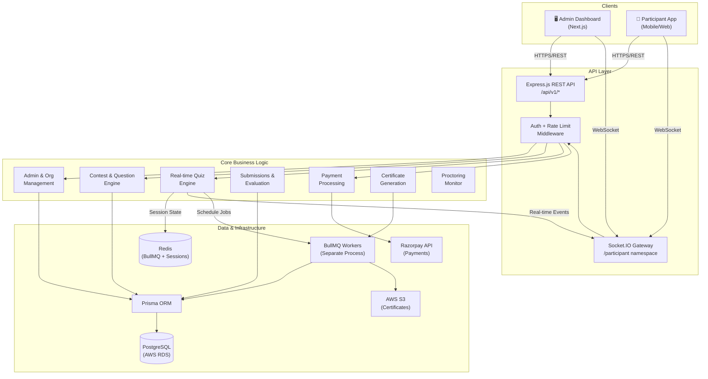

---

## 2. Dual-Mode Infrastructure (Idle vs Live)

The central architectural decision: two completely different infrastructure stacks for two completely different load profiles. Contest traffic is near-zero between events, then 10,000 sustained WebSocket connections during a 30-minute to 2-hour quiz.

```mermaid
graph LR
    subgraph "IDLE MODE — ~$35-40/month"
        direction TB
        EC2_Admin["🖥️ Admin EC2\nt3.small/medium\n(Elastic IP: 65.1.26.101)"]
        Docker_BE["Backend Container\nExpress + Socket.IO"]
        Docker_W["Worker Container\nBullMQ Consumer"]
        Docker_FE["Frontend Container\nNext.js SSR"]
        Docker_R["Redis Container\nlocalhost:6379"]
        EC2_Admin --> Docker_BE
        EC2_Admin --> Docker_W
        EC2_Admin --> Docker_FE
        EC2_Admin --> Docker_R
    end
    subgraph "LIVE MODE — +$14-30/contest day"
        direction TB
        ALB["⚡ Application Load Balancer\nHTTPS:443 + WebSocket"]
        AdminTG["Admin Target Group\n→ Admin EC2\n(dashboard, registration, payments)"]
        QuizTG["Quiz Target Group\n→ ASG 2-10 × t3.medium\n(WebSocket, /api/quiz/*)"]
        ElastiCache["🔴 ElastiCache Redis\nr6g.large × 2\n(Primary + Replica, HA)"]
        ALB -->|/socket.io/*\n/api/quiz/*| QuizTG
        ALB -->|Everything else| AdminTG
        QuizTG --> ElastiCache
        AdminTG --> ElastiCache
    end
    DNS["Route53\nysmquizbuzz.com"]
    DNS -->|A record → Elastic IP\n(idle mode)| EC2_Admin
    DNS -->|ALIAS → ALB\n(live mode)| ALB
    RDS[("Aurora PostgreSQL\nServerless v2\nauto-pauses when idle")]
    EC2_Admin --> RDS
    QuizTG --> RDS
```

### Mode Switch Scripts

| Script | Action | Duration |
|--------|--------|---------|
| `go-live.sh` | `terraform apply` → DNS propagation wait → ALB health check → smoke tests | ~10 minutes |
| `go-idle.sh` | Drain BullMQ queues → `terraform destroy` live resources → verify DNS reverted | ~8 minutes |
| `redis-migrate.js` | `DUMP/RESTORE` all Redis keys between Docker container ↔ ElastiCache (both directions) | ~2 minutes |

**Why this design:** Contest workload is 99% idle + 1% extreme burst on a known schedule. Pre-warming based on registered participant count beats reactive autoscaling for any scheduled workload where peak demand is known in advance.

---

## 3. AWS Deployment Architecture (Terraform)

Full Terraform-managed infrastructure. Every resource in both modes declared in `terraform/`.

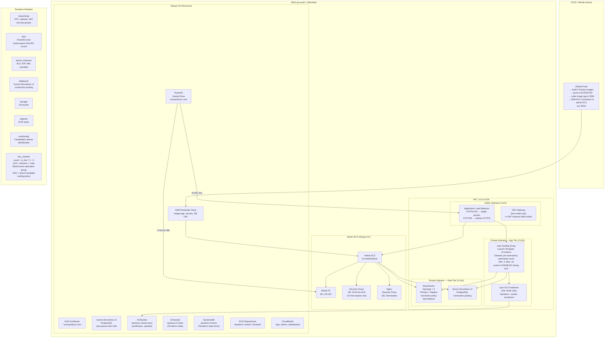

### ALB Listener Rules (Priority Order)

| Priority | Path Pattern | Target Group | Purpose |
|----------|-------------|-------------|---------|
| 10 | `/socket.io/*` | Quiz ASG | WebSocket connections (sticky, 1-day cookie, 5-min drain) |
| 15 | `/api/quiz/*` | Quiz ASG | Quiz REST API |
| 20 | `/api/*` | Admin EC2 | Admin REST API |
| 100 | `*` (default) | Admin EC2 | Next.js frontend, static assets |

### Terraform Variables

```hcl
variable "mode" {
  # "idle"  → only admin EC2 + always-on resources
  # "live"  → + ALB + ElastiCache + ASG (live_contest module)
  default = "idle"
}
variable "expected_participants" {
  # Used to calculate desired ASG capacity:
  # instances = ceil(expected_participants / 800)
  # Capped at 10 instances max
  default = 0
}
variable "image_tag" {
  # Docker image tag deployed to all containers
  # Written to SSM by CI/CD pipeline
}
```

### go-live.sh Flow

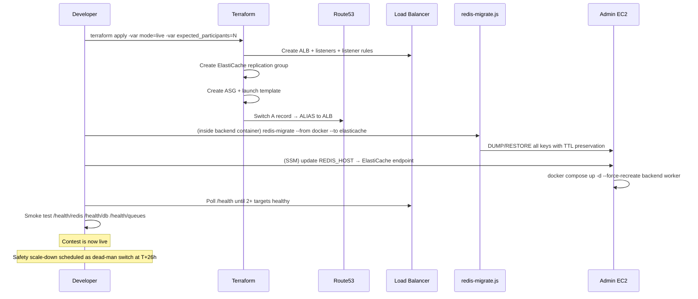

---

## 4. Backend Module Architecture

Strict layered architecture. Request → Router → Controller → Service → Repository → Prisma. Zero business logic in controllers. Zero Prisma calls outside repositories.

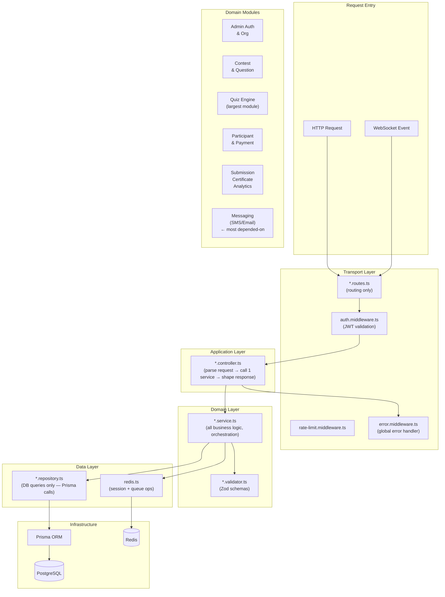

### Module Dependency Graph

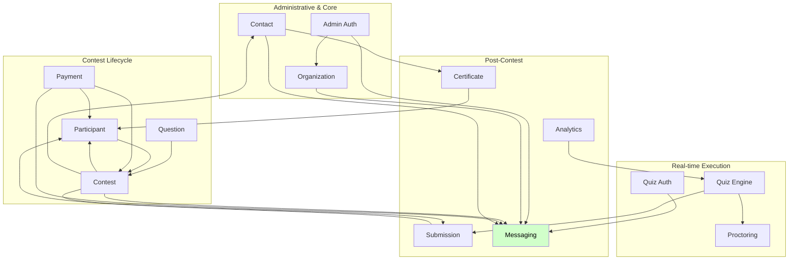

**System gravity (modules by dependency count):**

| Module | Incoming | Outgoing | Role |
|--------|---------|---------|------|
| Messaging | 7 | 0 | Shared comms infrastructure |
| Contest | 4 | 4 | Primary domain entity |
| Participant | 5 | 1 | Bridge: users ↔ events |
| Quiz | 1 | 3 | Core real-time hub |

---

## 5. Real-Time WebSocket Flow

The quiz module owns the core real-time engine. Two Socket.IO namespaces: `/participant` (10,000 users) and `/admin` (monitoring dashboard).

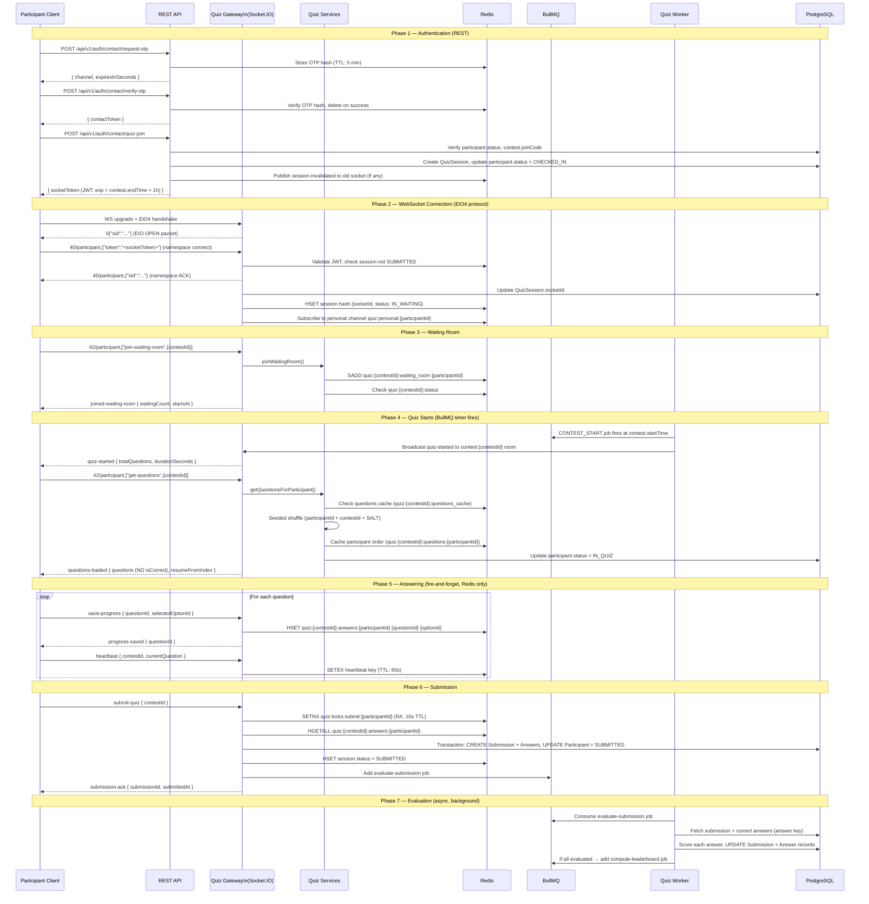

### Socket.IO EIO4 Wire Protocol

A raw WebSocket client (like k6) must implement the full EIO4 framing:

```
Open:        0{"sid":"...","pingInterval":25000,"pingTimeout":20000}
NS Connect:  40/participant,{"token":"<jwt>"}
NS ACK:      40/participant,{"sid":"..."}
Event Send:  42/participant,["quiz:v1:join",{...}]
Event Recv:  42/participant,["quiz:v1:start",{...}]
Ping:        2  (server → client, every 25s)
Pong:        3  (client → server, required or connection drops)
```

---

## 6. Database Schema (ER Diagram)

~25 Prisma models. Every table carrying organization-owned data includes `organizationId` — full multi-tenancy enforced at the query layer.

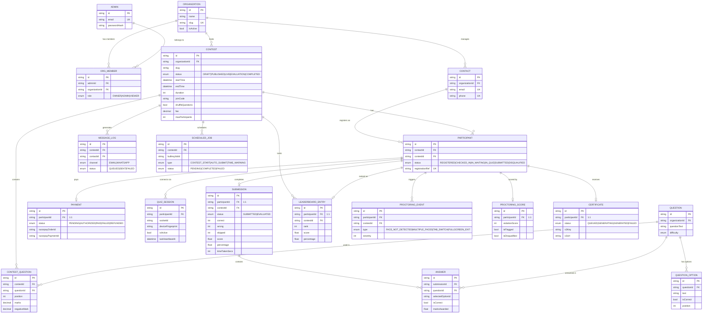

---

## 7. Background Worker System

All slow/unreliable/bursty work runs in a separate Docker container consuming BullMQ queues. The API/WebSocket container never blocks on heavy operations.

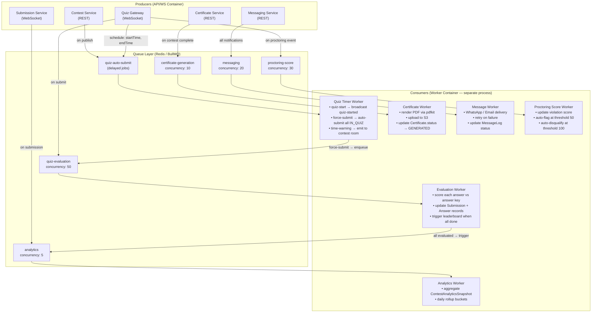

---

## 8. Quiz Module Deep Dive

The largest module. Manages the full participant lifecycle from OTP authentication through real-time quiz execution to submission.

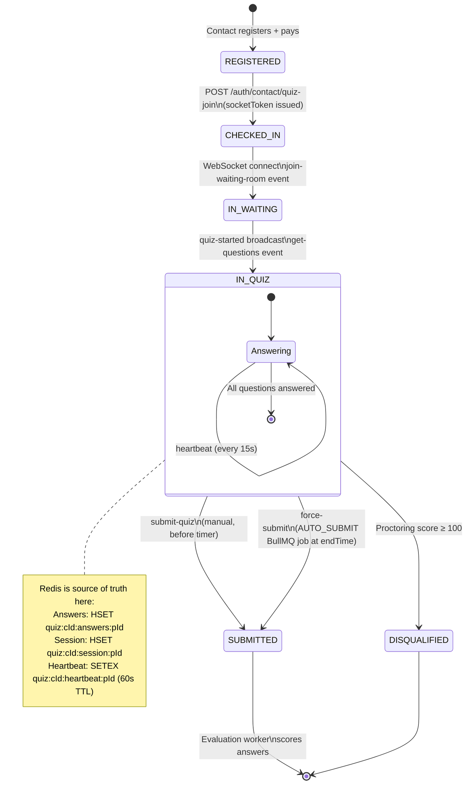

### Exactly-Once Submission Guarantee

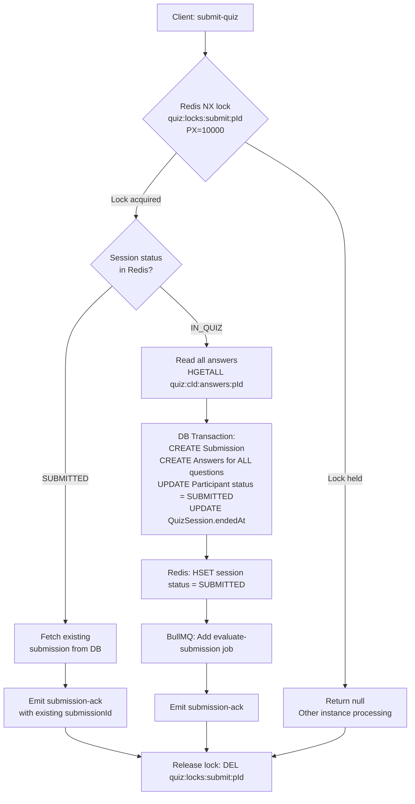

### Reconnect Handling

```mermaid
flowchart TD
    A[Client reconnects\nwith same socketToken] --> B{Redis session\nexists?}
    B -->|No session| C[Treat as new connection\nstart from join-waiting-room]
    B -->|status = IN_WAITING| D[Re-add to waiting room\njoin contest socket room]
    B -->|status = IN_QUIZ| E[Skip waiting room\nSend resume-quiz event]
    B -->|status = SUBMITTED| F[Emit submission-ack\nwith existing submissionId]
    E --> G[get-questions: read cached order\nfrom quiz:cId:questions:pId]
    G --> H[Read saved answers\nHGETALL quiz:cId:answers:pId]
    H --> I[Emit resume-quiz\n{currentQuestion, savedAnswers}]
    I --> J[Client restores state\nno data lost]
```

---

## 9. Redis Key Schema

All keys: `quiz:{contestId}:{dataType}:{participantId}` — scoped per-contest, per-participant.

| Key Pattern | Type | TTL | Content |
|-------------|------|-----|---------|
| `quiz:{cId}:session:{pId}` | Hash | 2h | socketId, status, startedAt, currentQuestion, deviceFingerprint |
| `quiz:{cId}:answers:{pId}` | Hash | 24h | {questionId → selectedOptionId} — source of truth for in-progress answers |
| `quiz:{cId}:heartbeat:{pId}` | String | 60s | timestamp — dead-man switch. Expires = disconnected |
| `quiz:{cId}:questions:{pId}` | String | 1h | JSON array of question IDs in participant's shuffled order |
| `quiz:{cId}:questions_cache` | String | 1h | JSON full question objects (shared across all participants) |
| `quiz:{cId}:waiting_room` | Set | 24h | Set of participantIds currently in waiting room |
| `quiz:{cId}:status` | String | 1h | Contest status string (cache layer over DB) |
| `quiz:locks:submit:{pId}` | String | 10s | NX lock — prevents duplicate submission processing |
| `quiz:locks:session:{pId}` | String | 5s | NX lock — prevents duplicate question-fetch race |
| `quiz:personal:{pId}` | Pub/Sub | — | Cross-instance personal events (session-invalidated, disqualified) |

**Memory per participant at peak:** ~18.6 KB
**1,000 participants total:** ~37 MB (including Redis allocator overhead)
**Redis container limit:** 256 MB → 6× headroom at 1,000 users

---

## 10. CI/CD Pipeline

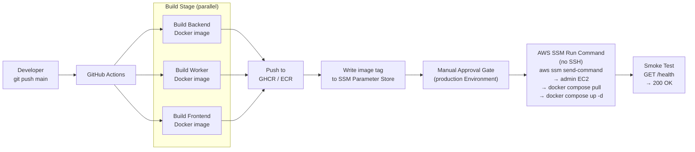

**Why SSM instead of SSH:**
The admin EC2 has no inbound SSH rule. All deploys go through AWS Systems Manager Run Command — no SSH key management, full audit trail in CloudWatch, works from GitHub Actions with only an IAM role.

---

## 11. Load Testing Results

**Date:** June 27–28, 2026
**Environment:** AWS ap-south-1, production infrastructure
**Tool:** k6 with custom Socket.IO EIO4 implementation

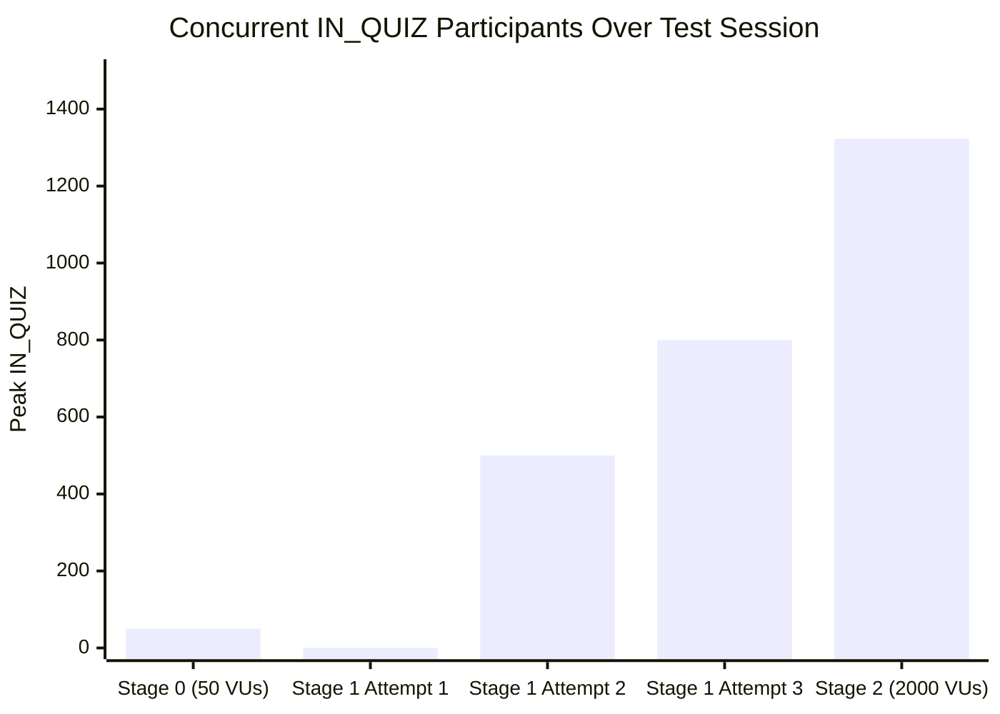

| Metric | Result |
|--------|--------|
| Peak simultaneous IN_QUIZ | **1,323** |
| Successful submissions (end-to-end) | **140** (remainder lost to OOM + AUTO_SUBMIT bug — both since fixed) |
| Seed performance improvement | **630×** (42 min → 4.1 sec) |
| Bugs documented and root-caused | **24** |
| Evaluation worker: confirmed working | ✅ |
| ElastiCache connectivity: confirmed | ✅ |
| Socket.IO EIO4 protocol: confirmed | ✅ |
| Admin live monitor: confirmed | ✅ |

### Bugs by Category

| Category | Count | Examples |
|----------|-------|---------|
| Infrastructure / Terraform | 5 | HTTPS listener missing, ElastiCache eviction policy, COOKIE_DOMAIN stale |
| Redis / dual-backend | 4 | CONTEST_START job lost, AUTO_SUBMIT undercounting |
| Protocol | 2 | Socket.IO EIO4 framing, wrong question payload shape |
| Seed tooling | 6 | Prisma v7 adapter, IPv4/IPv6, bulk SQL, 42-min performance |
| Configuration | 4 | Rate limit units, DB pool size, heap limit, file descriptors |
| Architecture (design) | 3 | CPU-based autoscaling wrong metric, no readiness check, sticky sessions disabled |

**Gap between 1,323 and 10,000:** Documented explicitly with root-cause and remediation plan. The OOM crashes and AUTO_SUBMIT undercounting are fixed in code. Pre-warmed scaling (not CPU-reactive) is the next infrastructure change. See Outstanding Items in full incident log.

---

*Architecture documentation version: 1.0*
*Last updated: July 2026*
*Engineer: Austin Makasare*
*GitHub: [github.com/aUSTIN0022](https://github.com/aUSTIN0022/)*
