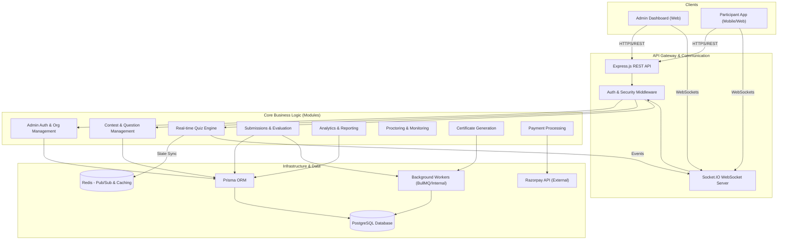
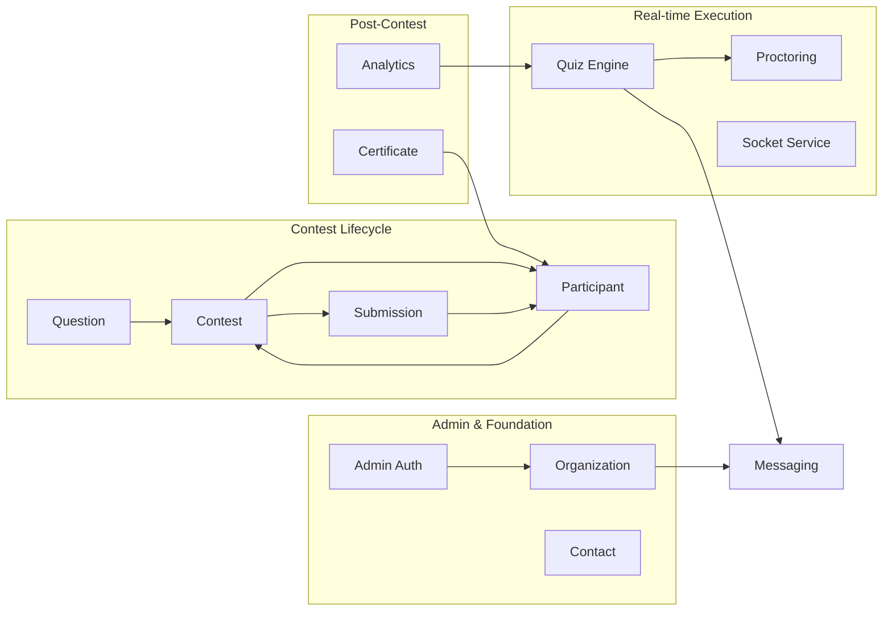

# QuizBuzz Backend Architecture

This document provides a visual and structural overview of the QuizBuzz backend, generated via `/graphify`.

## High-Level Component Diagram

The following C4-style diagram illustrates the primary components of the system and their interactions.

## Module Dependency Graph

The system is organized into decoupled modules, wired together via a central dependency container (`container.ts`).

## Infrastructure Map

| Component | Technology | Purpose |
| :--- | :--- | :--- |
| **Runtime** | Node.js (TypeScript) | Primary execution environment |
| **Web Framework** | Express.js | REST API routing and middleware |
| **Real-time** | Socket.IO | Bi-directional communication for live quizzes |
| **Database** | PostgreSQL | Persistent relational data storage |
| **ORM** | Prisma | Type-safe database access and migrations |
| **Cache/Queue** | Redis | Quiz state management and worker queues |
| **DI Container** | Manual (Inversion of Control) | Centralized dependency management in `container.ts` |
| **Logging** | Winston/Logger | Structured application logging |

## Key Directories

- `src/modules/`: Contains domain-specific logic (Controller, Service, Repository, Gateway).
- `src/container.ts`: The "brain" that instantiates and links all components.
- `src/socket/`: Core WebSocket infrastructure and adapters.
- `src/workers/`: Background task processing logic.
- `prisma/`: Database schema and migration definitions.
