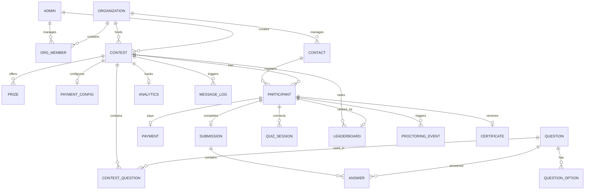

# QuizBuzz Database ER Diagram

This document provides a visual representation of the PostgreSQL schema managed by Prisma. The system is designed for multi-tenancy, high-concurrency real-time events, and robust proctoring.

## Core Entity-Relationship Diagram

## Functional Model Breakdown

### 1. Multitenancy & Admin
*   **Organization**: The root entity. All data (contests, questions, participants) belongs to an Org.
*   **Admin & OrgMember**: Platform users who manage organizations via Role-Based Access Control (RBAC).

### 2. Contest & Question Bank
*   **Contest**: The central event configuration (time, rules, status).
*   **Question & QuestionOption**: A global question bank per organization, reusable across multiple contests.
*   **ContestQuestion**: A join table that sets question order and marks for a specific contest.

### 3. Participant Lifecycle
*   **Contact**: The "Master Record" for a person (email/phone).
*   **Participant**: A specific registration of a Contact for a Contest.
*   **Payment**: Records financial transactions (Razorpay integration) tied to a registration.

### 4. Real-time & Results
*   **QuizSession**: Tracks the actual WebSocket connection and device telemetry during a live quiz.
*   **Submission & Answer**: The final record of participant performance, persisted from Redis after the quiz ends.
*   **LeaderboardEntry**: Computed rankings and prize allocation.

### 5. Observability & Analytics
*   **ProctoringEvent**: Granular logs of violations (tab switching, face detection, etc.).
*   **MessageLog**: Audit trail for all SMS and Email communication.
*   **ScheduledJob**: Persistence for background tasks (BullMQ) for the Admin UI.
*   **ContestAnalyticsSnapshot**: Pre-aggregated data for fast dashboard rendering.

## Key Relationships & Constraints

| Relation | Type | Constraint | Purpose |
| :--- | :--- | :--- | :--- |
| **Org ↔ Contest** | 1:N | `onDelete: Restrict` | Prevents deleting an Org with active contests. |
| **Contact ↔ Participant** | 1:N | `unique(contactId, contestId)` | Ensures one registration per user per contest. |
| **Participant ↔ Submission** | 1:1 | `unique(participantId)` | Ensures exactly one final answer sheet per person. |
| **Contest ↔ Question** | N:M | `ContestQuestion` join | Allows question reuse and custom marking per event. |
| **Participant ↔ Payment** | 1:1 | `onDelete: Cascade` | Ties registration validity to payment success. |
