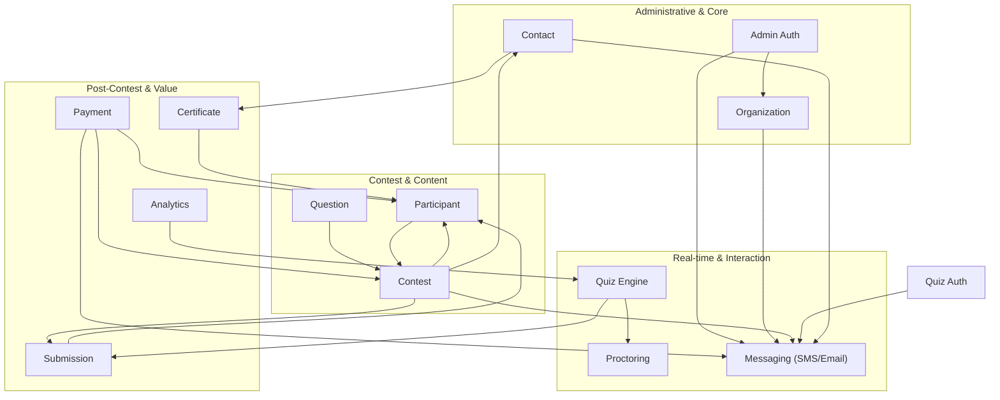

# QuizBuzz Modules Dependency Graph

This document visualizes the relationships and dependencies between the various domain modules located in `src/modules/`.

## Module Relationship Diagram

This graph illustrates how services from different modules depend on each other, revealing the core hierarchy of the system.

## Functional Clustering

To better understand the system, we can categorize modules based on their primary responsibility.

### 1. Administrative Layer
*   **Organization**: Manages corporate/client entities and their members.
*   **Admin Auth**: Handles administrator authentication and authorization.
*   **Contact**: Manages support tickets and communication between admins and participants.

### 2. Contest Orchestration
*   **Contest**: The main entity managing events, timelines, and configurations.
*   **Question**: Manages question banks, options, and difficulty levels.
*   **Participant**: Manages registration and presence of users in contests.
*   **Payment**: Handles Razorpay integrations for contest registrations.

### 3. Real-time Execution
*   **Quiz**: The core engine for live synchronized question delivery.
*   **Proctoring**: Monitors participant behavior (tab switching, camera, etc.).
*   **Messaging**: Centralized provider for all SMS and Email notifications.

### 4. Results & Reporting
*   **Submission**: Records and evaluates participant answers.
*   **Analytics**: Computes score distributions, performance trends, and leaderboard metrics.
*   **Certificate**: Handles the dynamic generation and delivery of PDFs.

## System Gravity (Centralized Modules)

Based on the dependency count, these modules are the "heaviest" or most central to the system:

| Module | Incoming Dependencies | Outgoing Dependencies | Role |
| :--- | :---: | :---: | :--- |
| **Contest** | 4 | 4 | The primary domain entity. |
| **Messaging** | 7 | 0 | Shared communication infrastructure. |
| **Participant** | 5 | 1 | Bridge between users and events. |
| **Quiz** | 1 | 3 | Core real-time interaction hub. |

## Inter-Module Communication Pattern

Most inter-module communication happens at the **Service Layer**. 
*   **Direct Injection**: Modules inject other module services into their own services (e.g., `ContestService` injects `MessagingService`).
*   **Shared Repositories**: Occasionally, a service might use a repository from another domain for simple read operations to avoid circular service dependencies (e.g., `AdminAuthService` uses `OrganizationRepository`).
