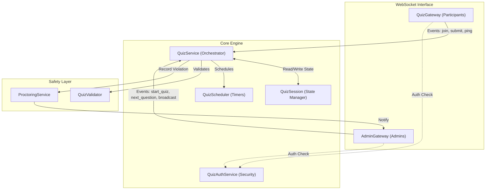
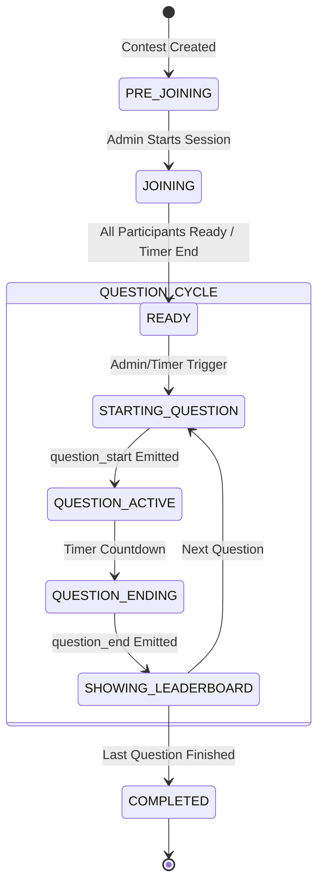

# Quiz Module: Internal Engine Architecture

The `src/modules/quiz` directory contains the core real-time engine of QuizBuzz. This module manages live synchronized competition, state synchronization, and proctoring.

## Real-time Interaction Model

The module uses two distinct gateways to separate participant interaction from administrative control, all orchestrated by a shared set of services.

## Quiz Session State Flow (Question Lifecycle)

The following diagram illustrates how the `QuizSession` state evolves during a live contest.

## Component Roles & Responsibilities

| File | Primary Role | Key Responsibility |
| :--- | :--- | :--- |
| `quiz.session.ts` | **State Container** | Manages in-memory maps for participants, scores, and current question index. Syncs to Redis for horizontal scale. |
| `quiz.service.ts` | **Business Logic** | Processes submissions, calculates scores, and manages the "truth" of the session state. |
| `quiz.gateway.ts` | **Participant I/O** | Handles participant-side Socket.IO events (`answer_submitted`, `participant_ready`). |
| `admin.gateway.ts` | **Administrative I/O** | Handles admin-side control signals (`start_quiz`, `skip_question`, `ban_participant`). |
| `quiz-scheduler.service.ts` | **Orchestration** | Manages the precision timing required for synchronized question delivery. |
| `proctoring.service.ts` | **Monitoring** | Listens for telemetry from clients (tab switches, visibility changes) and logs violations. |
| `quiz-auth.service.ts` | **Gatekeeper** | Validates JWTs and verifies that participants are actually registered for the contest they are trying to join. |

## Internal Event Bus (Conceptual)

While it uses Socket.IO for external communication, internally the module behaves like a state machine:

1.  **Incoming Trigger**: (e.g., `AG.next_question`)
2.  **State Update**: `QS` updates `QSession`.
3.  **Side Effects**: `QSch` calculates the next timer window.
4.  **Outgoing Emission**: `QG` and `AG` broadcast the updated state to their respective namespaces.
