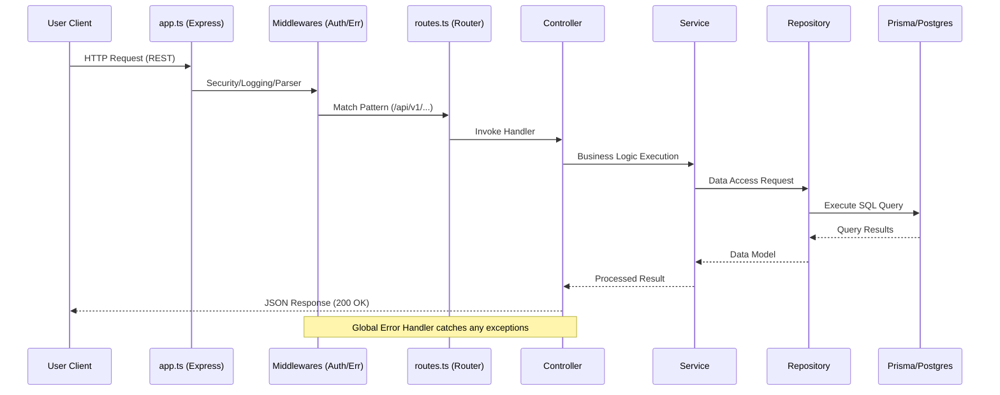
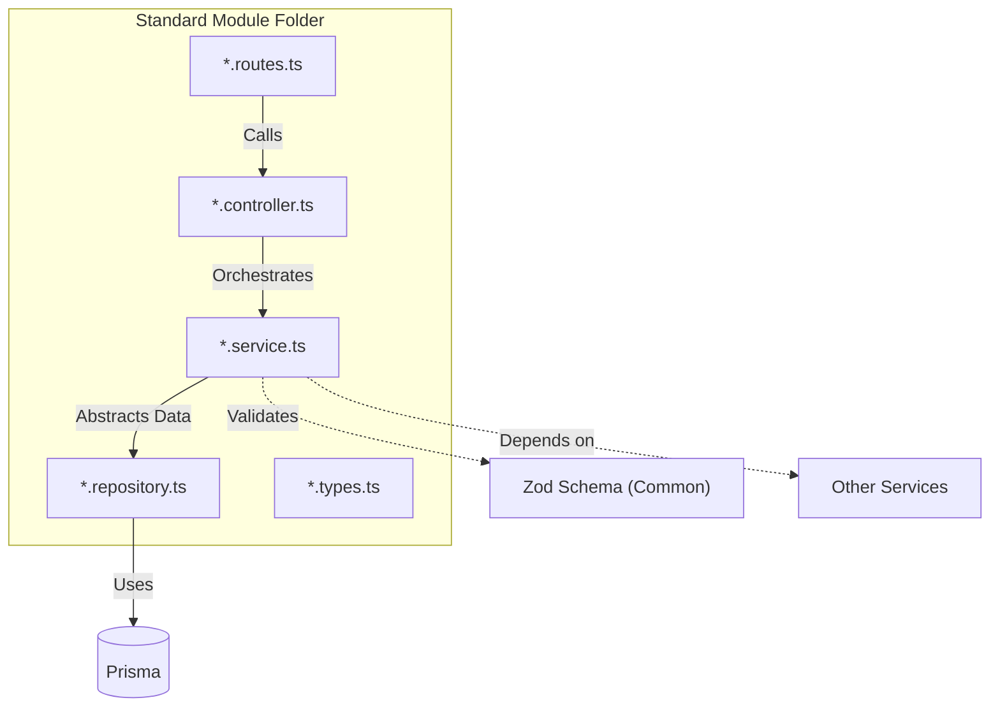
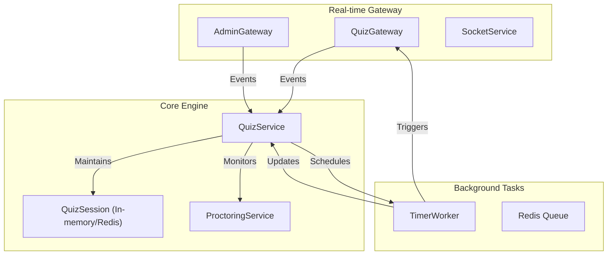

# QuizBuzz /src/ Directory Architecture

This document provides a granular visualization of the internal logic and data flow within the `src` directory.

## Request Lifecycle Flow

The following diagram maps how an HTTP request travels through the system from the entry point to the database and back.

## Domain Module Pattern (Standardized)

Each module in `src/modules/` follows a consistent architectural pattern to ensure maintainability and separation of concerns.

## WebSocket Logic & Quiz Engine

The `src/modules/quiz` module is the most complex, integrating with the core `socket` infrastructure for real-time interactivity.

## `src` Directory Map

| Directory | Purpose | Key Files |
| :--- | :--- | :--- |
| `common/` | Shared constants, schemas, and base classes | `constants.ts`, `schemas/` |
| `config/` | Application configuration and connection setups | `db.ts`, `redis.ts`, `logger.ts` |
| `middlewares/` | Express middlewares for auth, errors, and validation | `auth.middleware.ts`, `error.middleware.ts` |
| `modules/` | Domain-driven business logic modules | `contest/`, `quiz/`, `admin/` |
| `providers/` | External service wrappers | `razorpay.provider.ts` |
| `socket/` | WebSocket core setup and shared adapters | `socket.ts`, `redis-adapter.ts` |
| `workers/` | Background job processing logic | `quiz-timer.worker.ts` |

## Data Flow: Real-time Quiz Example

1.  **Participant Joins**: Participant hits `QuizGateway` via Socket.IO.
2.  **Authentication**: `QuizAuthService` validates the token via `MessagingService`.
3.  **State Initialization**: `QuizService` fetches contest data and initializes `QuizSession`.
4.  **Timer Start**: `QuizSchedulerService` queues a job in `TimerWorker`.
5.  **Broadcast**: `TimerWorker` triggers the `QuizGateway` to emit "question_start" to all participants.
6.  **Submission**: Participants submit answers; `SubmissionService` stores them in PostgreSQL while `QuizSession` tracks progress.
