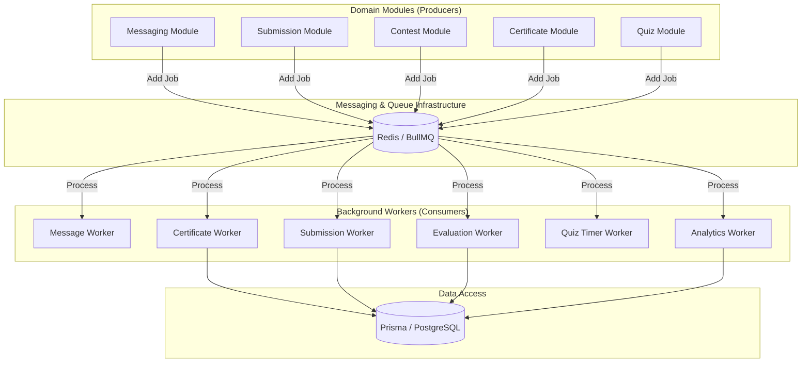
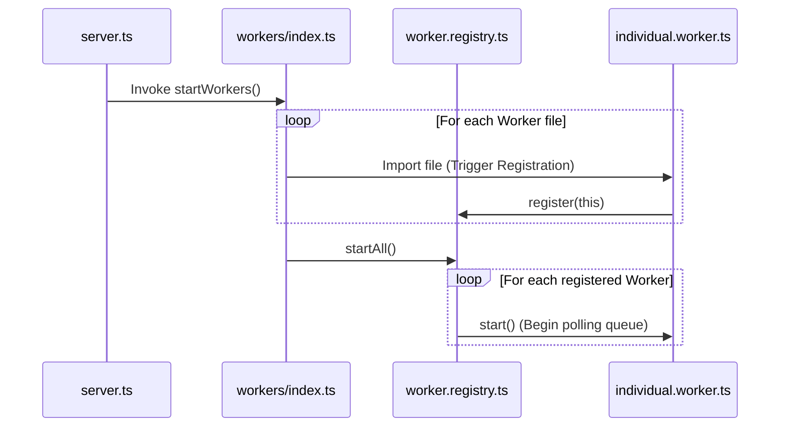

# QuizBuzz Worker System Architecture

The `src/workers` directory manages all asynchronous and long-running background tasks. The system uses a **Producer-Consumer** pattern facilitated by a centralized registry.

## Asynchronous Task Flow

This diagram illustrates how business modules offload heavy tasks to the background workers.

## Worker Initialization Lifecycle

The system uses a registration pattern to decouple worker implementation from server bootstrap.

## Worker Catalog & Responsibilities

| Worker | Triggering Event | Core Responsibility |
| :--- | :--- | :--- |
| **Message Worker** | SMS/Email requested | Integrates with external providers to deliver notifications. |
| **Submission Worker** | Answer submitted | Persists and validates individual question responses. |
| **Evaluation Worker** | Quiz finished | Calculates final scores, ranks, and updates leaderboards. |
| **Certificate Worker** | Contest completed | Generates PDF certificates with dynamic participant data. |
| **Quiz Timer Worker** | Question started | Manages precise countdowns and triggers state transitions. |
| **Analytics Worker** | Real-time events | Aggregates data for live dashboards and performance reports. |

## Key Implementation Patterns

*   **Self-Registration**: Workers register themselves with the `workerRegistry` upon module import, simplifying the main entry point.
*   **Dependency Injection**: Workers often require services and repositories. These are either imported from `container.ts` or injected via initialization functions (e.g., `injectTimerWorkerDeps`).
*   **Error Handling**: The `WorkerRegistry` handles individual start failures gracefully, ensuring one bad worker doesn't crash the entire background subsystem.
*   **Progress Tracking**: Several workers (Submission, Evaluation) implement granular progress reporting (10%, 40%, etc.) for administrative visibility.
